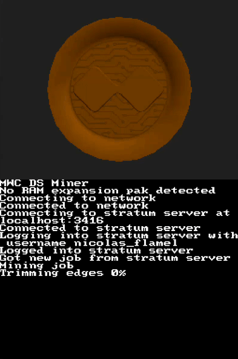

# MWC DS Miner  

	

  

### Description
Cuckatoo31 miner for the Nintendo DS that can be used to mine [MimbleWimble Coin (MWC)](https://mwc.mw). This achieves mining speeds of less than 0.0000001 graphs per second.

The Nintendo DS, released in 2004, is the oldest Nintendo handheld console that's capable of mining MimbleWimble Coin. Not only do its predecessors, the Game Boy and Game Boy Advance, lack the network capabilities required to communicate with a mining server, but they also lack the battery life needed to remain powered on long enough to process a cuckatoo31 graph. The Nintendo DS has neither of these issues thanks to its built-in Wi-Fi and rechargeable battery. Boasting a whopping 4MB of RAM, the Nintendo DS comes just short of the 512MB of RAM required to perform cuckatoo31's lean trimming step efficiently. This difference in RAM was overcome by processing the trimming step's nodes bitmap in 2MB parts and by paging the trimming step's edges bitmap to disk in 1MB parts. The result is an incredibly slow cuckatoo31 mining implementation that uses approximately 3MB of RAM and 256MB of disk space.

### Building
Install [devkitPro](https://devkitpro.org) or [BlocksDS](https://blocksds.github.io/docs/) and run a `make` command to build this application.

### Usage
Copy the `MWC_DS_Miner.nds` and `stratum_server_settings.txt` files from this application's [newest release](https://github.com/NicolasFlamel1/MWC-DS-Miner/releases) to your Nintendo DS flashcart. Edit the `stratum_server_settings.txt` file so that its first line is the address and port of the stratum server that you want to connect to (e.g. `192.168.0.100:3416`) and its second line is the optional username that you want to use when mining to that stratum server. Then run the `MWC_DS_Miner.nds` file on your Nintendo DS and it will connect to the provided stratum server and start mining.

This application attempts to connect to the access point stored in your Nintendo DS's network settings. This access point can be changed by editing your Nintendo DS's network settings from within any game that supports Wi-Fi.

If a RAM expansion pak is inserted into your Nintendo DS's slot-2, this application will use it to slightly speed up the mining process. This allows the trimming step to use up to 32MB nodes bitmap parts and 2MB edges bitmap parts.
